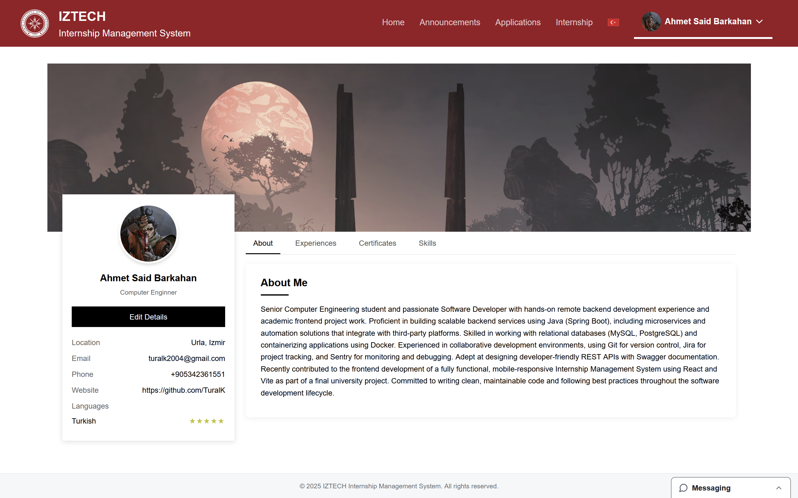

📚 Internship Management System – IZTECH

This is a comprehensive web-based Internship Management System developed for Izmir Institute of Technology (IZTECH) to manage and streamline the internship process for students, companies, secretaries, and administrators.

The system is fully responsive and supports all major devices, providing role-based dashboards and access to a wide range of internship-related functionalities.

## 🔗 Backend Repository

You can find the backend code for this project here:  
👉 [Internship Management System – Backend](github.com/softwaredeveloper591/Find-Internship-Company-Microservice)

## 🔗 Frontend Repository
This repository contains frontend code of IMS

🌐 Live Preview

    🔗  https://youtu.be/B23iw-9nf9c

🚀 Features
🔐 Authentication

    Login, Forgot Password, and Change Password pages
    
  
  
  

    Role-based access: Student, Company, Secretary, Admin

👨‍🎓 Student Portal

    Signup page
  
    
    Home page for Summer Practice Regulations
  

    Create Profile and Profile pages:
  
  

    Dashboard with announcements
  

    Announcement page:
  
    
    Applications and status tracking
  
    
    Internship Page (Student)
    After finishing their internship, students use this page to upload required documents and track the feedback/approval status of their internship.
  

    Student settings page:
  

    Student Information page for auto-filling user information in applications
  

    Link generation for unregistered companies to upload documents

    Mobile-friendly

🏢 Company Portal

    Signup page
  

    Applications dashboard
  

    Application page
  

    Publishing announcement page
  

    Internship management page
  
    
    Profile & create profile pages

    Settings page

🛠 Admin Portal

    Manage and approve company registration requests
  

    Company announcements dashboard
  
    
    Approve company announcements
  

    Student applications dashboard
  
    
    Review student applications
  

    Student internships dashboard
  
    
    View internship reports and give necessary feedbaacks/ reject / approve internship
  
    
    Handle unregistered company document uploads (Automatically generate 3 day valid link for company to upload documents)

    Settings page

📄 Secretary Panel

    Review internship application forms

    Upload and provide employment certificates

    Document validation and feedback
    
  

    Settings page
    
📁 Manual Upload (for unregistered companies)

    Authorized access to upload required documents
  

    Unauthorized acceess
  

💬 Chat System

    Add users to chat threads
  

    Direct messaging between roles
  
    
    Integrated AI chatbot for student inquiries
  
  

📷 Screenshots

    Screenshots of all user interfaces and modules are available in the repo’s screenshots/ directory or above in the README.
    
📦 Installation

    # Clone the repository
    [git clone https://github.com/TuralK/AIS-frontend.git]
    cd AIS-frontend
    
    # Install dependencies
    npm install
    
    # Start development server
    npm run dev

📱 Mobile Responsiveness

    This app is fully responsive and optimized for mobile, tablet, and desktop devices using modern responsive design practices and Tailwind CSS utility classes.
